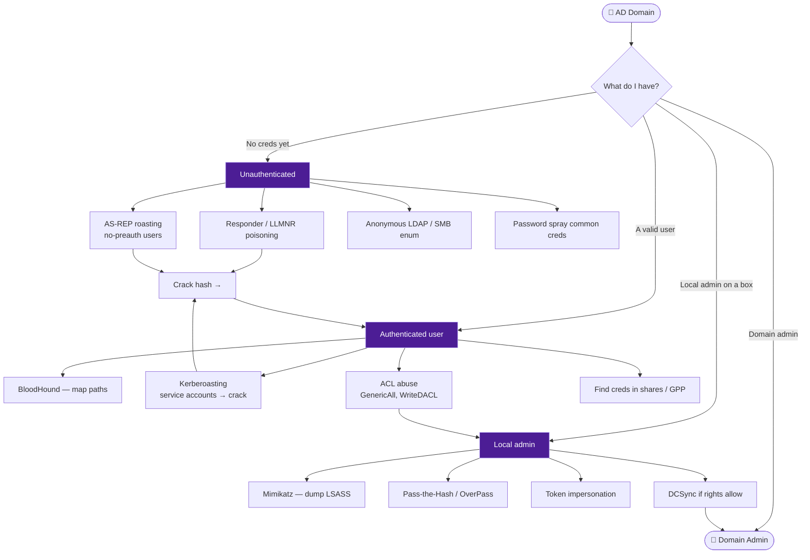

# 🏰 Active Directory Attacks

← back to [[Red Team Ideology]]

## The AD loop
**Enumerate → get a credential → crack/relay it → escalate rights → repeat until DA.**

1. **Foothold** — poison with Responder, or spray/AS-REP roast for a first hash.
2. **Map** — run BloodHound (`nxc`/`bloodhound-python`), find shortest path to DA.
3. **Escalate** — Kerberoast, ACL abuse, or dump creds from a box you own.
4. **Domain takeover** — DCSync → `krbtgt` hash → Golden Ticket → persistence.

**Tools:** BloodHound · `impacket` (secretsdump, GetUserSPNs) · `nxc`/`crackmapexec` · Rubeus · Mimikatz · Responder
Feeds into → [[Password & Credential Attacks]]
