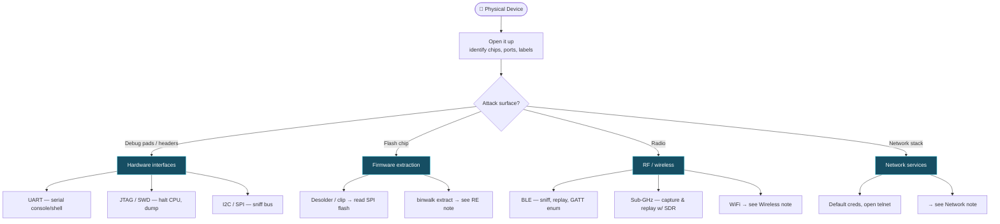

# 🔌 Hardware & IoT Attacks

← back to [[Red Team Ideology]]

## Workflow
1. **Physical recon** — teardown, read chip part numbers, find test pads.
2. **Get a console** — UART is the usual quick win (`screen`/`minicom` at 115200).
3. **Dump firmware** — via bootloader, `esptool` (ESP32), or SPI flash reader.
4. **Analyze** — `binwalk` the dump, then reverse extracted binaries.
5. **RF** — capture/replay with an SDR or dedicated radio; BLE with `bettercap`/`nRF`.

**Your kit:** ESP32 (great for RF/WiFi tooling & building your own implants) · logic analyzer · USB-UART adapter · `esptool` · `binwalk`
> ESP32 note: you've got this in the lab — good for evil-portal / deauth-detector builds and learning UART/SPI hands-on.
