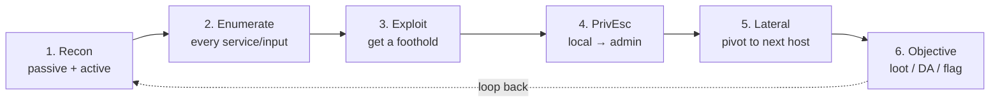

# 🧾 Methodology Cheatsheet

← back to [[Red Team Ideology]]

The universal loop, regardless of target:

## Quick prompts per stage
- **Recon:** What is this? Who owns it? What's exposed? (`nmap`, OSINT, `ffuf`)
- **Enumerate:** Versions, defaults, misconfigs, every input field.
- **Exploit:** Match version → known PoC, or abuse a logic/injection flaw.
- **PrivEsc:** `linpeas`/`winpeas`, sudo/SUID, kernel, stored creds, tokens.
- **Lateral:** Reuse creds, pivot, tunnel; map with BloodHound if AD.
- **Objective:** Grab the flag / data / DA, document everything as you go.

## Note-taking discipline (OSCP habit)
Log every command + output as you go. Screenshots for the report. Timestamp findings. Future-you and the exam clock will thank you.

## Practice ground
HTB · TryHackMe · PortSwigger Academy · VulnHub · PicoCTF (for RE/pwn)

---
**Domains:** [[Web App Attacks]] · [[Network & Infra Attacks]] · [[Active Directory Attacks]] · [[Wireless Attacks]] · [[Reverse Engineering]] · [[Hardware & IoT Attacks]] · [[Social Engineering]] · [[Password & Credential Attacks]]
