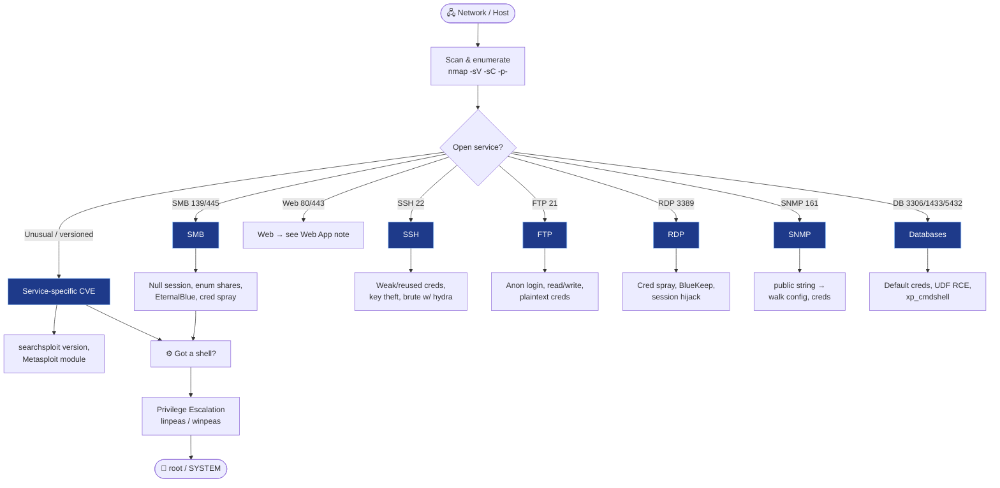

# 🖧 Network & Infra Attacks

← back to [[Red Team Ideology]]

## Workflow
1. **Scan** — `nmap -sC -sV -p-` then targeted scripts.
2. **Enumerate each service** — banners, versions, default creds, anonymous access.
3. **Exploit** — `searchsploit <service version>`, public PoC, or Metasploit.
4. **Foothold → PrivEsc** — run `linpeas`/`winpeas`, check sudo, SUID, cron, kernel.
5. **Escalate creds:** see [[Password & Credential Attacks]]; if domain-joined → [[Active Directory Attacks]].

**Tools:** `nmap` · `crackmapexec`/`nxc` · `enum4linux-ng` · Metasploit · `searchsploit`
