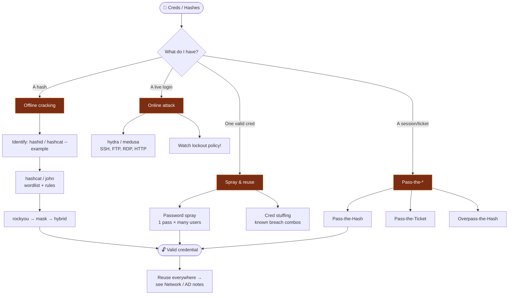

# 🔑 Password & Credential Attacks

← back to [[Red Team Ideology]]

## Workflow
1. **Identify** the hash type first (`hashid`, `hashcat --example-hashes`).
2. **Crack offline** — always prefer this over noisy online brute force.
   - `hashcat -m <mode> hash.txt rockyou.txt -r rules/best64.rule`
3. **Online** only when you must — respect lockout thresholds; spray > brute.
4. **Pass-the-* ** — often you don't need to crack; the hash/ticket *is* the key (AD).
5. **Reuse** — humans reuse passwords; try each win against every service.

**Tools:** `hashcat` · `john` · `hydra`/`medusa` · `hashid` · `impacket` (PtH/PtT) · CeWL/Mentalist (custom wordlists)
**Wordlists:** rockyou, SecLists, custom from OSINT.
