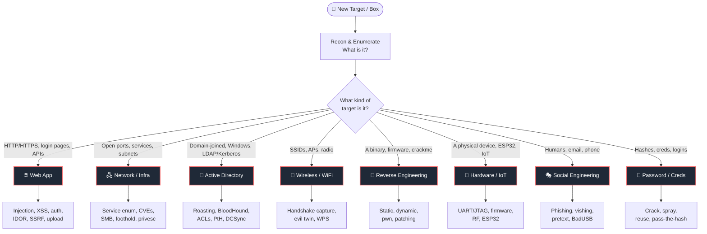

# 🧠 Red Team Ideology — Master Flowchart

> **How to use:** Start at the top. Identify *what kind of box / target* is in front of you, follow the branch, then open the linked domain note to drill into specific attacks. This is a living map — add nodes as you learn.

## 🎯 Where am I? (Triage the target)

## 🗺️ The Kill Chain (mental model behind every branch)

Every domain note below maps onto this chain: you **recon → enumerate → get a foothold → escalate → move → achieve objective.**

---

## 📂 Domain Notes (drill down)

| Target | Note | You reach for it when… |
|---|---|---|
| 🌐 Web | [[Web App Attacks]] | There's a website, API, or login |
| 🖧 Network | [[Network & Infra Attacks]] | You have IPs, ports, and services |
| 🏰 AD | [[Active Directory Attacks]] | It's a Windows domain |
| 📶 WiFi | [[Wireless Attacks]] | You're attacking radio / SSIDs |
| 🔬 RE | [[Reverse Engineering]] | You have a binary or firmware |
| 🔌 Hardware | [[Hardware & IoT Attacks]] | Physical device, ESP32, embedded |
| 🎭 SocEng | [[Social Engineering]] | The target is people |
| 🔑 Creds | [[Password & Credential Attacks]] | You have hashes or need to auth |

---

## 🧰 Always-on toolbelt

- **Recon:** `nmap`, `masscan`, `amass`, `ffuf`, `gobuster`, `subfinder`
- **Web:** Burp Suite, `sqlmap`, `nikto`, `wpscan`
- **AD:** BloodHound, `impacket`, `crackmapexec`/`nxc`, `rubeus`
- **Creds:** `hashcat`, `john`, `hydra`
- **Post-ex:** `mimikatz`, `linpeas`/`winpeas`, Metasploit
- **Wireless:** `aircrack-ng`, `hcxdumptool`, `bettercap`

> ⚠️ **Rules of engagement:** everything here is for authorized testing, labs (HTB/THM/OSCP), and CTFs only. Scope first, get it in writing, stay in bounds.

*See also: [[Methodology Cheatsheet]]*
