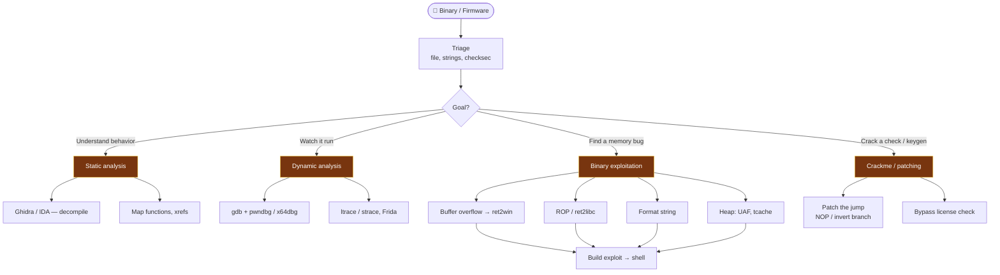

# 🔬 Reverse Engineering

← back to [[Red Team Ideology]]

## Workflow
1. **Triage** — `file`, `strings`, `checksec` (NX, PIE, canary, RELRO).
2. **Static** — load in Ghidra, find `main`, follow user-input paths.
3. **Dynamic** — run under `gdb`/pwndbg, set breakpoints, watch memory.
4. **Exploit** — mitigation-dependent: overflow → ROP if NX, leak libc if ASLR.
5. **Automate** — script the exploit with `pwntools`.

**Tools:** Ghidra · IDA · `gdb` + pwndbg/GEF · `pwntools` · `radare2`/Cutler · Frida · `binwalk` (firmware)
> Firmware from a device? Pull it apart with `binwalk`, then treat extracted binaries here. Physical extraction → [[Hardware & IoT Attacks]].
