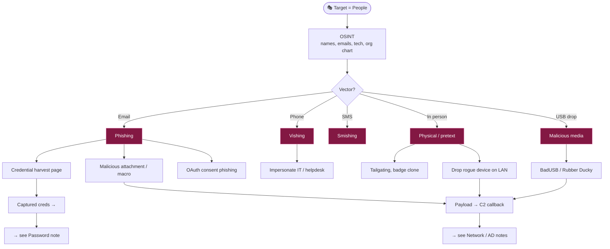

# 🎭 Social Engineering

← back to [[Red Team Ideology]]

## Workflow
1. **OSINT** — harvest emails/naming convention (`hunter.io`, LinkedIn), tech stack, targets.
2. **Pretext** — build a believable story tied to something real (invoice, IT ticket, delivery).
3. **Deliver** — cred-harvest clone, macro doc, or QR/OAuth lure via evilginx/GoPhish.
4. **Capture → pivot** — creds feed auth attacks; payloads give a C2 foothold.

**Tools:** GoPhish · evilginx2 · SET · `theHarvester` · Maltego · Flipper/Rubber Ducky (physical)
> Only within an authorized engagement with explicit written scope. Human-targeted testing has strict legal/ethical lines — respect them.
