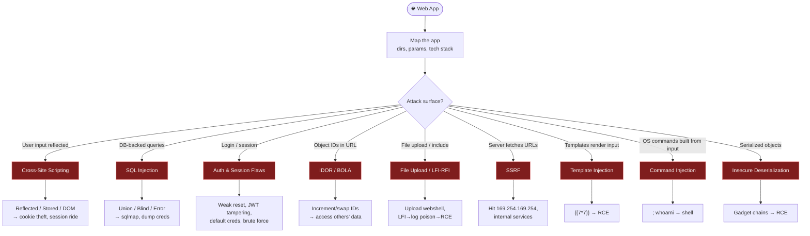

# 🌐 Web App Attacks

← back to [[Red Team Ideology]]

## Workflow
1. **Enumerate** — `ffuf`/`gobuster` dirs, `whatweb`/Wappalyzer stack, spider in Burp.
2. **Test inputs** — every param, header, cookie against the vuln classes above.
3. **Escalate** — turn a vuln into a shell (webshell, SSTI/CMDI RCE) or data (SQLi dump).
4. **Reference:** OWASP Top 10, PortSwigger Web Security Academy.

**Tools:** Burp Suite · `sqlmap` · `ffuf` · `nikto` · `wpscan` · `nuclei`
