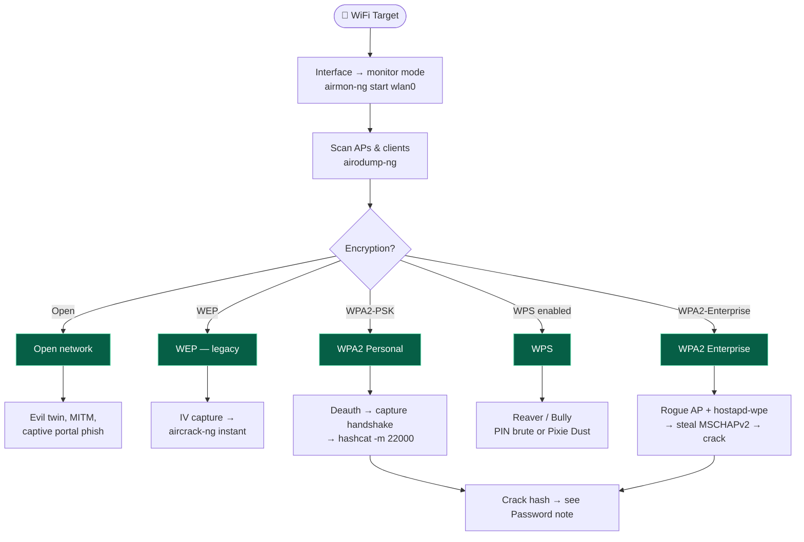

# 📶 Wireless Attacks

← back to [[Red Team Ideology]]

## Workflow
1. **Monitor mode** — `airmon-ng start wlan0`, kill interfering processes.
2. **Recon** — `airodump-ng` to list APs, channels, connected clients.
3. **Capture** — deauth a client (`aireplay-ng --deauth`) to force a handshake.
4. **Crack offline** — feed to `hashcat -m 22000` with a wordlist (rockyou, etc.).
5. **Beyond the key** — evil twin / rogue AP for creds; pivot onto the LAN → [[Network & Infra Attacks]].

**Tools:** `aircrack-ng` suite · `hcxdumptool`/`hcxpcapngtool` · `hostapd-wpe` · `bettercap` · `wifite`
> Needs a monitor-mode capable adapter (e.g. Alfa). Test only on your own networks / lab.
